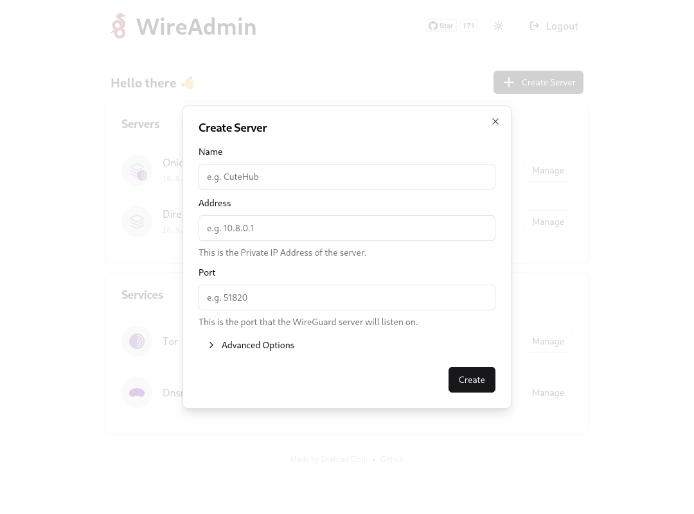

# WireGuard (Easy Admin UI)

[](https://github.com/wireadmin/wireadmin/actions/workflows/ci.yml)
[](https://opensource.org/licenses/GPL-3.0)


|                                                                                            |                                                                                            |                                                                                            |
| :----------------------------------------------------------------------------------------: | :----------------------------------------------------------------------------------------: | :----------------------------------------------------------------------------------------: |
|  |  |  |

---

- [Features](#features)
- [Build locally](#build-locally)
- [Image](#image)
- [Ports](#ports)
- [Usage](#usage)
  - [Docker Compose](#docker-compose)
  - [Command line](#command-line)
  - [Persistent Data](#persistent-data)
  - [Environment variables](#environment-variables)
- [Upgrade](#upgrade)
- [Contributing](#contributing)
- [License](#license)

## Features

- Simple and friendly UI
- Support for multiple users and servers
- Support for **Tor for anonymized connections**
- Server connection statistics
- List, create, delete, or modify any server or user
- Create QR codes
- Easily download the client configurations.
- Automatic Light/Dark Mode

## Image

| Registry                                                                                                | Image                         |
| ------------------------------------------------------------------------------------------------------- | ----------------------------- |
| [Docker Hub](https://hub.docker.com/r/shahradel/wireadmin/)                                             | `shahradel/wireadmin`         |
| [GitHub Container Registry](https://github.com/users/shahradelahi/packages/container/package/cfw-proxy) | `ghcr.io/wireadmin/wireadmin` |

## Ports

- `53`: Dnsmasq
- `3000`: WebUI

And for any additional ports of WireGuard instance, should be exposed through Docker.

## Usage

### Docker Compose

Docker compose is the recommended way to run this image. You can use the following
[docker compose template](docker-compose.yml), then run the container:

```bash
docker compose up -d
docker compose logs -f
```

### Command line

```shell
$ docker run -d \
  --name wireadmin \
  -e WG_HOST="<YOUR_SERVER_IP>" \
  -e ADMIN_PASSWORD="<ADMIN_PASSWORD>" \
  -p "3000:3000/tcp" \
  -p "51820:51820/udp" \
  --cap-add=NET_ADMIN \
  --cap-add=SYS_MODULE \
  --sysctl="net.ipv4.conf.all.src_valid_mark=1" \
  --sysctl="net.ipv4.ip_forward=1" \
  ghcr.io/wireadmin/wireadmin
```

> 💡 Replace `<YOUR_SERVER_IP>` with the IP address of your server.

> 💡 Replace `<ADMIN_PASSWORD>` with the password for the admin UI.

The Web UI will now be available on `http://0.0.0.0:3000`.

### Persistent Data

It's important to mount a volume to ensure that your data is not lost during container restarts or updates. Here is the list of required volumes:

- `wireadmin-data`: `/data`
- `tor-data`: `/var/lib/tor`

To create a docker volume, use the following command:

```bash
$ docker volume create "<volume>" --driver local
```

> 💡 Replace `<volume>` with the name of the volume.

Finally, to mount the volumes with `-v` flag in the `docker run` command:

```bash
$ docker run -d \
  -v wireadmin-data:/data \
  -v tor-data:/var/lib/tor \
  ghcr.io/wireadmin/wireadmin
```

### Environment variables

These options can be configured by setting environment variables using `-e KEY="VALUE"` in the `docker run` command.

| Option            | Description                                                                         | Default             | Optional |
| ----------------- | ----------------------------------------------------------------------------------- | ------------------- | -------- |
| `WG_HOST`         | The public IP address of the WireGuard server.                                      | -                   |          |
| `ADMIN_PASSWORD`  | The password for the web UI.                                                        | `insecure-password` |          |
| `HOST`            | The hostname for the WebUI.                                                         | `127.0.0.1`         | ✔️       |
| `PORT`            | The port for the WebUI.                                                             | `3000`              | ✔️       |
| `TOR_USE_BRIDGES` | Set this to `1` and then mount the bridges file at `/etc/tor/torrc.d/bridges.conf`. | -                   | ✔️       |
| `TOR_*`           | The `Torrc` proxy configuration. (e.g. `SocksPort` as `TOR_SOCKS_PORT="9050"`)      | -                   | ✔️       |

## Upgrade

Recreate the container whenever I push an update:

```bash
$ docker compose pull
$ docker compose up -d
```

## Contributing

Want to contribute? Awesome! To show your support is to star the project, or to raise issues
on [GitHub](https://github.com/wireadmin/wireadmin)

Thanks again for your support, it is much appreciated! 🙏

## License

[GPL-3.0](/LICENSE) © [Shahrad Elahi](https://github.com/shahradelahi)
