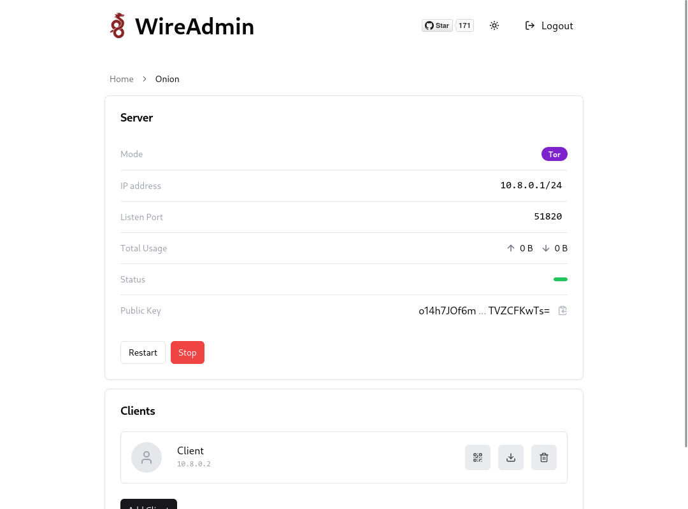

# WireGuard GUI (Easy Admin UI)


|                                                                                            |                                                                                            |
|:------------------------------------------------------------------------------------------:|:------------------------------------------------------------------------------------------:| 
|  |  |

## Features

- Easy-to-use web-based admin UI
- Support for multiple users and servers
- Support for **Tor to anonymize connections**
- List, create, delete, or modify any server or user
- Scan QR codes or easily download the client configurations.

## Requirements

* A host with a kernel that supports WireGuard.
* A host with Docker installed.

## Installation

### 1. Install Docker

To install Docker, go to the official documentation and install a version that meets your environment's requirements.

- [Install Docker Engine](https://docs.docker.com/engine/install/)

### 2. Run WireAdmin

Install WireAdmin using the command line:

```bash
docker run -d \
 --name wireadmin \
 -e WG_HOST="🚨YOUR_SERVER_IP" \
 -e UI_PASSWORD="🔐OPTIONAL_ADMIN_PASSWORD" \
 -p "3000:3000/tcp" \
 -p "51820:51820/udp" \
 -v "~/wireadmin-data:/data" \
 --cap-add=NET_ADMIN \
 --cap-add=SYS_MODULE \
 --sysctl="net.ipv4.conf.all.src_valid_mark=1" \
 --sysctl="net.ipv4.ip_forward=1" \ 
 --restart unless-stopped \
 ghcr.io/shahradelahi/wireadmin
```

Please note that the port `3000` is for the UI and it is up to you to remove it after configuring the Servers/Peers.

> IMPORTANT: When creating each server, ensure that you add the port exposure through Docker. (The port `51820` is added
> as an example.)

### 3. Enjoy

Please feel free to open an issue if you have any questions or suggestions.

## Environment Options

These options can be configured by setting environment variables using `-e KEY="VALUE"` in the `docker run` command.

| Option            | Description                                                                           | Default | Optional |
|-------------------|---------------------------------------------------------------------------------------|---------|----------|
| `WG_HOST`         | The public IP address of the WireGuard server.                                        | `""`    |          |
| `UI_PASSWORD`     | The password for the admin UI.                                                        | `""`    | ✔️       |
| `TOR_USE_BRIDGES` | Quick setup of Tor bridges. You have to mount the bridges file at `/etc/tor/bridges`. | `""`    | ✔️       |
| `TOR_*`           | The `Torrc` proxy configuration. (e.g. `SocksPort` as `TOR_SOCKSPORT="9050"`)         | `""`    | ✔️       |

## Support the Project

Seriously, this project is free and open-source, and all I ask for as support is for you to give a star to the
repository.

## License

This project is licensed under the MIT License—see the [LICENSE](LICENSE) file for details.
