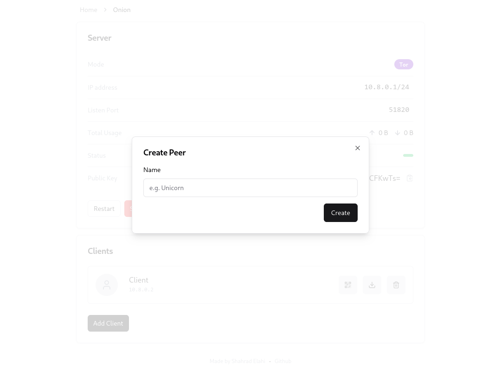

# WireGuard (Easy Admin UI)

[](https://github.com/shahradelahi/wireadmin/actions/workflows/ci.yml)
[](https://opensource.org/licenses/GPL-3.0)


|                                                                                            |                                                                                            |                                                                                            |
| :----------------------------------------------------------------------------------------: | :----------------------------------------------------------------------------------------: | :----------------------------------------------------------------------------------------: |
|  |  |  |

## Features

- Simple and friendly UI
- Support for multiple users and servers
- Support for **Tor for anonymized connections**
- Server connection statistics
- List, create, delete, or modify any server or user
- Create QR codes
- Easily download the client configurations.
- Automatic Light/Dark Mode

## Installation

### 1. Prerequisites

- [Docker Engine](https://docs.docker.com/engine/install/)

### 2. Docker Image

#### Build from source (recommended)

```bash
git clone https://github.com/shahradelahi/wireadmin
docker buildx build --tag litehex/wireadmin ./wireadmin
```

#### Pull from Docker Hub

```bash
docker pull litehex/wireadmin # OR ghcr.io/shahradelahi/wireadmin
```

### 3. Persistent Data

WireAdmin store configurations at `/data`. It's important to mount a volume at this location to ensure that
your data is not lost during container restarts or updates.

#### Create a docker volume

```bash
docker volume create wireadmin-data --driver local
```

### 4. Run WireAdmin

When creating each server, ensure that you add the port exposure through Docker. In the below command, the port `51820`
is added for the WireGuard server.

> 💡 The port `3000` is for the WebUI, and can be changed with `PORT` environment variable, but for security
> reasons, it's recommended to NOT expose **_any kind of WebUI_** to the public. It's up to you to remove it after
> configuring
> the Servers/Peers.

```shell
docker run --detach \
 --name wireadmin \
 -e WG_HOST=<YOUR_SERVER_IP> \
 -e UI_PASSWORD=<ADMIN_PASSWORD> \
 -p "3000:3000/tcp" \
 -p "51820:51820/udp" \
 -v "wireadmin-data:/data" \
 --cap-add=NET_ADMIN \
 --cap-add=SYS_MODULE \
 --sysctl="net.ipv4.conf.all.src_valid_mark=1" \
 --sysctl="net.ipv4.ip_forward=1" \
  litehex/wireadmin
```

> 💡 Replace `<YOUR_SERVER_IP>` with the IP address of your server.

> 💡 Replace `<ADMIN_PASSWORD>` with the password for the admin UI.

The Web UI will now be available on `http://0.0.0.0:3000`.

## Options

These options can be configured by setting environment variables using `-e KEY="VALUE"` in the `docker run` command.

| Option            | Description                                                                     | Default             | Optional |
| ----------------- | ------------------------------------------------------------------------------- | ------------------- | -------- |
| `WG_HOST`         | The public IP address of the WireGuard server.                                  | -                   |          |
| `UI_PASSWORD`     | The password for the admin UI.                                                  | `insecure-password` |          |
| `HOST`            | The hostname for the WebUI.                                                     | `127.0.0.1`         | ✔️       |
| `PORT`            | The port for the WebUI.                                                         | `3000`              | ✔️       |
| `TOR_USE_BRIDGES` | Set this to `1` and then mount the bridges file at `/etc/torrc.d/bridges.conf`. | -                   | ✔️       |
| `TOR_*`           | The `Torrc` proxy configuration. (e.g. `SocksPort` as `TOR_SOCKS_PORT="9050"`)  | -                   | ✔️       |

## Reporting

For bug reports, and feature requests, please create an issue
on [GitHub](https://github.com/shahradelahi/wireadmin/issues).

## License

[GPL-3.0](LICENSE) © [Shahrad Elahi](https://github.com/shahradelahi)
